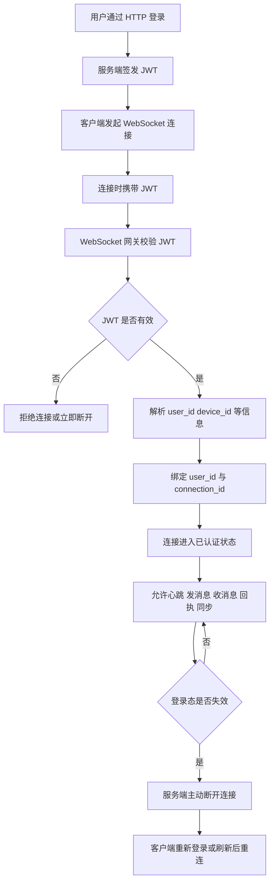
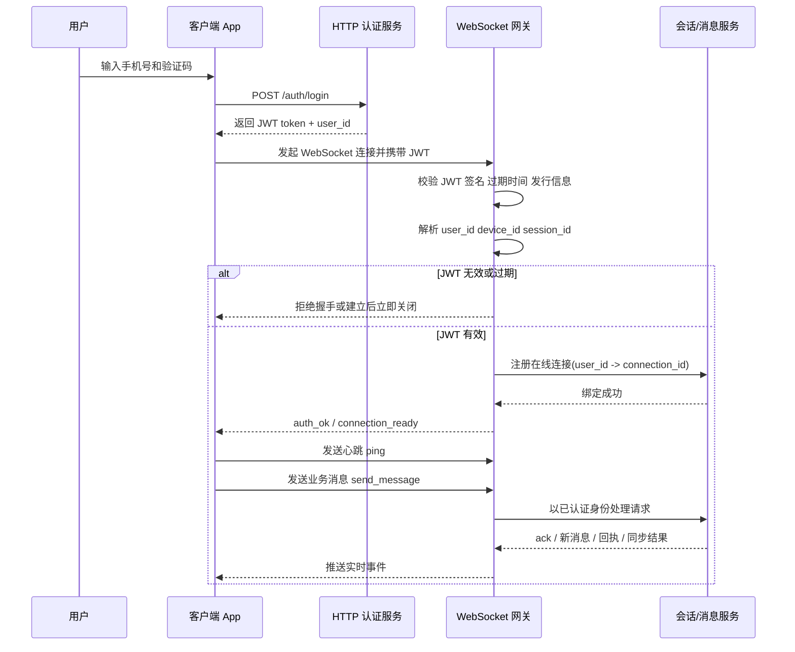
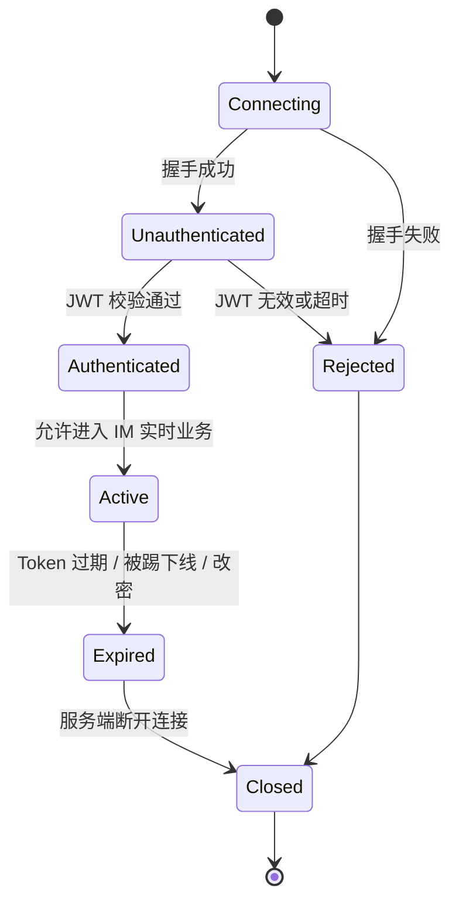

# IM 中 WebSocket 连接如何做 JWT 身份认证

## 1. 文档信息

- 项目：`flash_im`
- 主题：正式 IM 产品中，WebSocket 建连后的身份认证流程
- 目标：说明 JWT 用户认证与 WebSocket 心跳/实时通信如何衔接
- 边界：只讲整体流程和设计原则，不进入具体代码实现
- 时间：2026-06-04

## 2. 核心问题

当前我们已经有两个独立能力：

- HTTP 侧的 `JWT 用户认证`
- 长连接侧的 `WebSocket 心跳通信`

但在正式 IM 产品里，这两者不能各自独立存在，而是必须连起来。

系统真正要解决的问题不是：

**“WebSocket 能不能连上？”**

而是：

**“这条 WebSocket 连接到底属于谁？”**

因为后续的所有实时行为都依赖这个身份：

- 谁在发送消息
- 谁在接收消息
- 谁在发心跳
- 谁在同步会话
- 谁在上报已读
- 谁应该被踢下线

所以，正式 IM 里的标准做法通常是：

1. 用户先通过 HTTP 登录拿到 JWT
2. 客户端建立 WebSocket 时带上 JWT
3. 服务端校验 JWT
4. 校验通过后，把这条连接绑定到某个 `user_id`
5. 后续所有实时消息都基于这条“已认证连接”处理

## 3. 一句话理解

可以把它理解成：

- HTTP 登录：负责“发证”
- JWT：负责“证明你是谁”
- WebSocket 鉴权：负责“验票并绑定连接身份”
- 心跳和消息：负责“在已认证连接上持续通信”

也就是说：

**WebSocket 连上，不等于用户已认证；只有 JWT 校验成功并绑定连接身份后，这条连接才真正可用。**

## 4. 推荐整体流程

先看推荐流程图。

这个图反映了一个很重要的边界：

**“连接建立成功” 和 “连接可用于 IM 业务” 不是同一个阶段。**

只有走到“绑定 `user_id` 与 `connection_id`”之后，这条连接才算真正进入在线状态。

## 5. 推荐时序图

这个时序里最关键的一点是：

**后端处理 WebSocket 消息时，应该相信“连接上下文里的 user_id”，而不是相信客户端消息体里自己传的 user_id。**

## 6. JWT 应该在什么时候带上

正式产品里常见有两种方式。

### 6.1 方式一：握手阶段就带上 JWT

也就是在建立 WebSocket 连接时，直接携带 token。

例如可以放在：

- 请求头
- `Sec-WebSocket-Protocol`
- 受控查询参数

优点：

- 服务端可以在升级连接前就决定是否放行
- 鉴权边界更清楚
- 未认证连接不会长时间存在

缺点：

- 某些平台和基础设施对 WebSocket 请求头支持有限
- 不同客户端实现方式可能略有差异

### 6.2 方式二：连接建立后，第一条消息做鉴权

也就是先允许连接建立，但客户端第一条必须发：

- `auth`
- `login`
- `bind_session`

这类认证消息。

优点：

- 跨平台实现通常更统一
- 便于把认证过程纳入自定义协议

缺点：

- 服务端要处理“连接已建立但尚未认证”的临时状态
- 需要明确规定未认证连接只能发哪些消息

## 7. 对 IM 更合理的建议

对于正式 IM，可以这样理解优先级：

### 7.1 第一目标：连接身份必须可确认

不管是握手鉴权还是首包鉴权，最终都要达到同一个目的：

**服务端明确知道这条连接对应哪个用户、哪个设备。**

### 7.2 第二目标：后续消息不能重复传用户身份当真值

客户端消息里可以带辅助字段，但真正可信的身份应该来自：

- JWT 校验结果
- 连接绑定上下文

而不是来自消息体里的 `user_id`。

### 7.3 第三目标：登录态变化要能影响现有连接

例如：

- token 过期
- 用户主动退出登录
- 用户被封禁
- 用户改密码
- 新设备顶掉旧设备

这些都应该能够让服务端主动断开已有 WebSocket 连接。

## 8. 服务端通常需要保存什么连接上下文

当鉴权成功后，服务端通常会在内存或连接管理器里保存：

- `connection_id`
- `user_id`
- `device_id`
- `session_id`
- 连接建立时间
- 最近一次心跳时间
- 当前连接状态

这样后续处理：

- 心跳超时
- 多端在线
- 单端踢下线
- 会话同步
- 消息路由

都会更容易。

## 9. 正式 IM 里常见的状态变化

可以把一条 WebSocket 连接的生命周期理解成下面这样：

这个状态图能帮助区分两个容易混淆的概念：

- `Unauthenticated`：连接存在，但还不能用于业务
- `Active`：连接已认证，才允许进入消息收发

## 10. 心跳和鉴权的关系

心跳本身不是鉴权手段。

心跳的作用主要是：

- 保持连接活跃
- 让服务端知道客户端还在线
- 检测断线、假在线、弱网重连

但心跳必须建立在“连接已经完成认证”的前提下。

也就是说，正确顺序应该是：

1. 先认证
2. 再进入心跳周期
3. 再承载消息收发

而不是反过来。

## 11. 多设备在线时要补充什么策略

正式 IM 一定会遇到这个问题：

**同一个账号是否允许多个 WebSocket 同时在线？**

常见策略有三种：

### 11.1 单设备在线

新连接上来时，旧连接被踢掉。

适合对安全要求高、设备并发要求低的场景。

### 11.2 多设备并存

同一账号可以在手机、平板、桌面同时在线。

适合 IM 主产品的常见场景。

### 11.3 部分多端在线

例如：

- 手机 + 桌面可以共存
- 同类型移动设备只允许一个

这时 JWT 里通常还要能区分设备信息，服务端连接上下文也要保留 `device_id`。

## 12. 推荐的正式化原则

如果把这件事压缩成几条可执行原则，建议记住下面几点：

1. 先通过 HTTP 登录拿 JWT，再建立 WebSocket。
2. WebSocket 连接必须经过 JWT 校验后，才能进入 IM 业务态。
3. 服务端以“连接绑定身份”为准，不以消息体自报身份为准。
4. token 失效、被踢下线、改密等事件，要能主动影响现有连接。
5. 心跳是在线保活机制，不是身份认证机制。

## 13. 总结

在正式 IM 产品里，JWT 用户认证和 WebSocket 连接不是两套分离系统，而是一条连续链路：

- HTTP 登录负责发 token
- WebSocket 建连负责校验 token
- 连接管理负责绑定身份
- 心跳和消息收发负责维持实时在线

所以更准确的说法不是：

**“WebSocket 怎么认证？”**

而是：

**“如何把 HTTP 登录得到的身份，安全地延续到实时连接中，并让后续所有实时行为都建立在这个已认证身份上。”**
