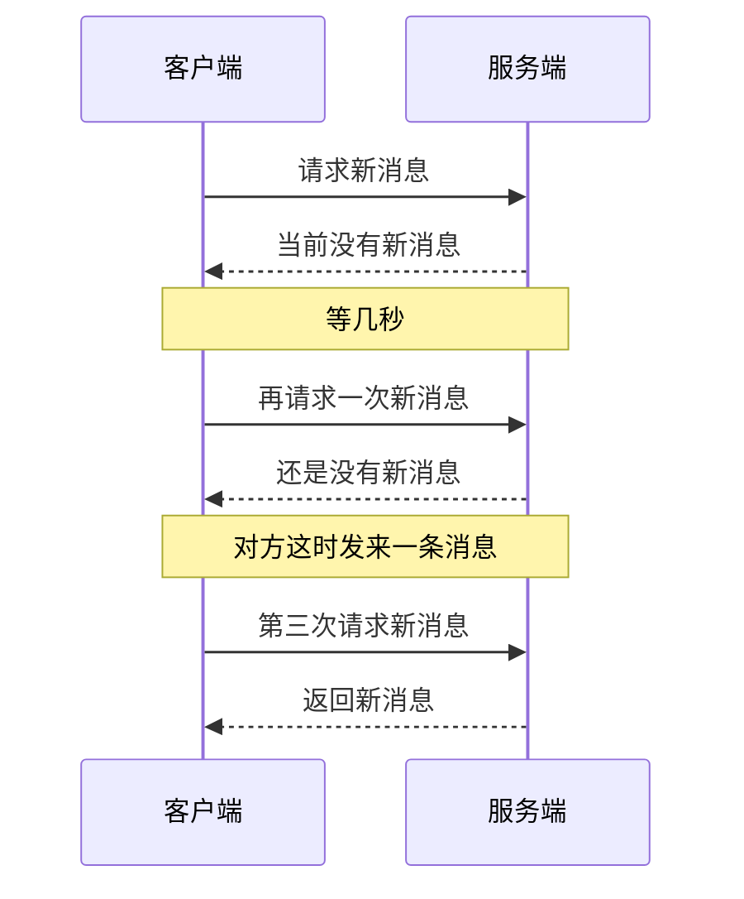
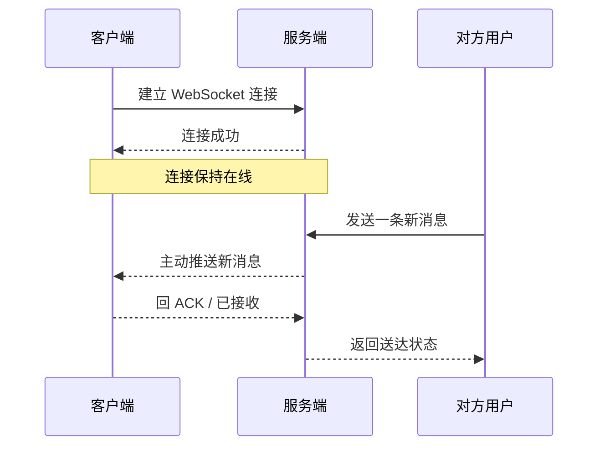
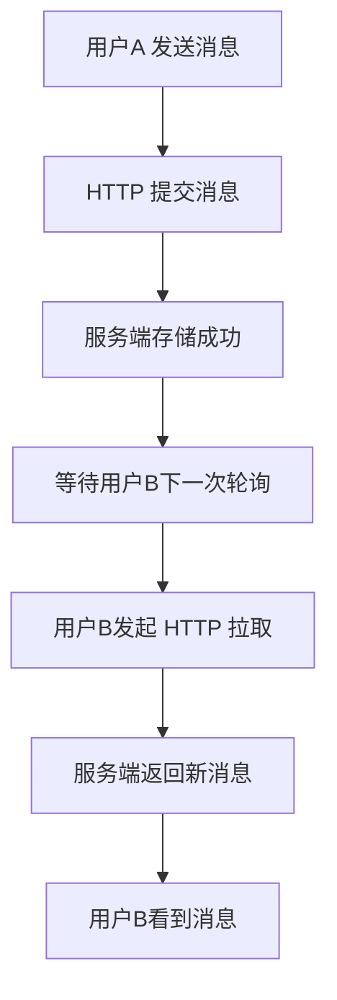
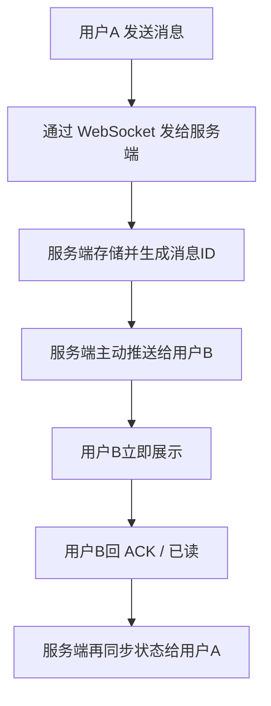
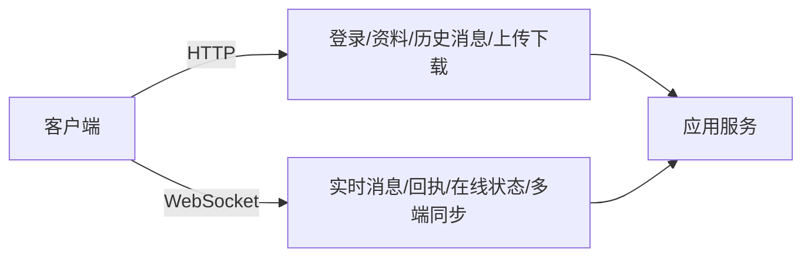

# IM 场景下 `HTTP` 与 `WebSocket` 的区别，以及为什么实时通信必须用 `WebSocket`

## 1. 文档信息

- 项目：`flash_im`
- 文档类型：技术研究 / 通信协议选型说明
- 编写时间：`2026-06-02`
- 目标：
  - 用通俗方式解释 `HTTP` 和 `WebSocket` 的核心区别
  - 说明为什么 IM 产品不能只靠 `HTTP`
  - 说明为什么 IM 的核心实时链路必须使用 `WebSocket`
  - 给出 IM 产品里两者的合理分工建议

## 2. 先说结论

一句话结论：

**`HTTP` 适合“请求一次，返回一次”的接口场景；`WebSocket` 适合“连接保持在线，双方随时说话”的实时场景。**

如果你在做的是即时通信产品，那么：

- 登录
- 拉历史消息
- 上传图片
- 获取配置

这些可以继续用 `HTTP`。

但是：

- 实时收消息
- 对方正在输入
- 已读回执
- 在线状态
- 群消息广播
- 多端同步推送

这些核心链路，**必须走 `WebSocket` 这类长连接实时通道**，否则产品体验会明显不达标。

## 3. 用生活化的方式理解两者

### 3.1 `HTTP` 像什么

`HTTP` 更像“打电话给前台问一次问题”：

1. 你拨号
2. 对方接通
3. 你提问
4. 对方回答
5. 通话结束

下次你再想问，就要重新打一次。

这很适合普通接口：

- “给我用户资料”
- “给我会话列表”
- “帮我提交这张图片”

### 3.2 `WebSocket` 像什么

`WebSocket` 更像“你和对方一直挂着语音通话”：

- 连接一旦建立，就先不挂断
- 你可以随时说话
- 对方也可以随时说话
- 不需要每次发消息都重新建连接

这就特别适合 IM：

- 我发一句话给你
- 服务器立刻把这句话推给对方
- 对方已读后，服务器再立即把已读状态推回来

## 4. 最核心的区别是什么

| 对比项 | `HTTP` | `WebSocket` |
| --- | --- | --- |
| 通信方式 | 请求-响应 | 持久连接、双向通信 |
| 连接特征 | 通常一次请求一次连接生命周期 | 建立一次，持续复用 |
| 谁先发起 | 基本总是客户端先发请求 | 客户端和服务端都可以主动发消息 |
| 服务端主动推送 | 不擅长 | 原生适合 |
| 实时性 | 一般 | 高 |
| 每次通信成本 | 较高，反复带协议头、反复进入请求流程 | 较低，连接复用后消息更轻 |
| IM 适配度 | 适合外围接口 | 适合核心实时链路 |

真正决定 IM 体验的，不是“能不能发消息”，而是：

- 服务端能不能主动推送
- 延迟能不能足够低
- 多端状态能不能快速同步
- 大量在线用户时成本能不能压住

而这几件事，恰恰都更偏向 `WebSocket`。

## 5. 从流程上看，`HTTP` 和 `WebSocket` 到底差在哪

### 5.1 用 `HTTP` 拉消息

如果只用 `HTTP`，客户端通常要不断轮询：

问题很明显：

- 没有新消息时，也在不断请求
- 服务端明明已经收到新消息，却不能立刻主动推给客户端
- 用户是否“马上看到消息”，取决于下一次轮询什么时候发生

这会带来三个直接问题：

1. 延迟不稳定
2. 浪费流量和请求资源
3. 在线人数一多，服务压力明显上升

### 5.2 用 `WebSocket` 收消息

如果改成 `WebSocket`，流程会变成这样：

这时的关键变化是：

- 客户端不需要反复问“有没有新消息”
- 服务端一旦有事件，就可以立刻推送
- 客户端收到后还可以马上回执

这才是 IM 真正需要的通信模式。

## 6. 为什么 IM 不能只靠 `HTTP`

### 6.1 因为 `HTTP` 天然不是“服务端主动说话”的模型

IM 的本质不是“我偶尔查一次数据”，而是：

- 只要有新消息，就要尽快送到
- 只要状态变化，就要尽快同步

比如：

- 对方发来消息
- 对方撤回消息
- 群名被修改
- 会话未读数变化
- 用户状态从离线变在线

这些事件并不是客户端“刚好发请求时”才发生。

如果还坚持只靠 `HTTP`，客户端只能：

- 高频轮询
- 长轮询
- 或者各种变形方案

本质上都是在弥补 `HTTP` 不是实时双向通道这个先天限制。

### 6.2 因为只靠轮询会让体验变差

假设你每 `5` 秒轮询一次：

- 用户可能最差要等 `5` 秒才看到消息
- 已读状态也会慢
- 会话列表最后一条消息更新时间也会慢

这对 IM 产品非常致命。

用户虽然不一定知道你底层用了什么协议，但他能明显感觉到：

- “为什么消息不是秒到？”
- “为什么我明明读了，对方那边还没显示已读？”
- “为什么群里消息刷出来很慢？”

即时通信里，“即时”本身就是产品价值的一部分。

### 6.3 因为只靠轮询会浪费大量资源

轮询最尴尬的一点是：

**绝大多数请求，其实什么都拿不到。**

比如 `10` 万在线用户，每人每 `3` 秒请求一次“有没有新消息”，就算大多数人此刻根本没有新消息，服务端也得持续处理这些空请求。

于是你会得到：

- 大量无意义的 QPS
- 更多网关压力
- 更多带宽消耗
- 更多客户端电量消耗

而 `WebSocket` 的思路是：

- 没事就保持连接
- 有事才传消息

对 IM 这种“长时间在线，但并非每秒都有消息”的场景更合适。

## 7. 为什么 IM 核心链路必须用 `WebSocket`

这里的“必须”，更准确地说，是：

**只要你想做一个体验正常、架构合理、可扩展的 IM，核心实时链路就基本必须用 `WebSocket` 或同类长连接方案。**

原因主要有六个。

### 7.1 服务端必须能主动推送消息

IM 最重要的一件事就是：

**服务端收到消息后，要立刻把它推给在线接收方。**

这不是“客户端来问一下”的场景，而是“服务端主动通知”的场景。

`WebSocket` 天然适合这个动作。

### 7.2 需要真正的双向通信

IM 不是只收消息，还需要立刻回状态：

- 客户端收到消息，回 ACK
- 客户端已读消息，回已读回执
- 客户端发消息，服务端回 server_msg_id
- 客户端重连后，发同步游标

这类来回交互非常频繁。

如果每一步都拆成独立 `HTTP` 请求：

- 时延更高
- 状态更碎
- 连接成本更高

而 `WebSocket` 天然就是双向收发。

### 7.3 需要稳定的低延迟

即时通信最怕的是：

- 有时候很快
- 有时候突然慢几秒

`HTTP` 轮询的延迟通常不稳定，因为它取决于：

- 轮询间隔
- 当前请求是否刚好打中时机
- 是否被网关和调度排队

`WebSocket` 长连接则更容易做到：

- 事件一到就发
- 消息到达路径更短
- 延迟更可控

### 7.4 需要承载在线状态与会话状态同步

IM 不是只有“文字消息”。

还包括：

- 在线 / 离线
- 输入中
- 已送达
- 已读
- 群资料变化
- 未读数变化
- 撤回通知

这些都属于“小而频繁”的状态事件。

用 `HTTP` 做，会变成很多零碎请求；用 `WebSocket` 做，这些状态事件可以自然挂在同一条实时通道里。

### 7.5 需要更好的多端同步能力

一个 IM 用户往往不只一个端：

- 手机
- 平板
- Web
- 桌面端

当某个端做了动作，比如：

- 在手机已读了一条消息
- 在桌面端撤回了一条消息

其他在线端应该尽快同步到这个变化。

这本质上也是“服务端向多个在线连接主动广播事件”的问题，`WebSocket` 正适合做这件事。

### 7.6 扩展性比“疯狂轮询”更合理

表面上看，维护海量长连接好像很重；但对 IM 来说，真正更不合理的，通常是海量无效轮询。

因为 IM 的典型负载不是：

- 每个人每秒都发消息

而是：

- 大量用户长时间在线
- 少量用户在某个时刻发生通信事件

这正是 `WebSocket` 最擅长的工作形态：

- 连接常驻
- 事件驱动
- 按需推送

## 8. 一个典型 IM 动作，对两种协议的影响差异

以“用户 A 给用户 B 发一条消息”为例。

### 8.1 如果主要靠 `HTTP`

问题在于：

- A 发出去了，不等于 B 立刻看到
- B 什么时候看到，取决于下一次拉取

### 8.2 如果主要靠 `WebSocket`

这才符合即时通信对“实时感”的要求。

## 9. 那是不是以后都不要 `HTTP` 了

不是。

正确做法不是“二选一”，而是“各用在最合适的位置”。

## 10. IM 产品里 `HTTP` 和 `WebSocket` 的合理分工

### 10.1 适合继续用 `HTTP` 的地方

- 登录 / 刷新 token
- 获取用户资料
- 拉取会话列表首屏
- 拉取历史消息
- 上传图片、语音、文件
- 下载附件
- 后台管理接口
- 非实时配置接口

这些场景特点是：

- 请求边界清晰
- 不要求服务端持续主动推送
- 更像标准 Web API

### 10.2 适合用 `WebSocket` 的地方

- 实时单聊消息
- 实时群聊消息
- 送达回执
- 已读回执
- 输入中状态
- 在线状态
- 撤回通知
- 会话最后一条消息更新
- 未读数更新
- 多端同步事件

这些场景共同特点是：

- 高频
- 小包
- 强实时
- 服务端需要主动推送

## 11. 最推荐的 IM 通信架构思路

对 IM 来说，最实用的方案通常是：

- **`HTTP` 做外围接口**
- **`WebSocket` 做核心实时通道**

可以用下面这个图理解：

这也是绝大多数 IM 系统最终会走到的工程形态。

## 12. 对当前项目的直接建议

如果你的 `flash_im` 之前已经用 `HTTP` 实现了一部分接口，那么最合理的下一步不是把所有东西推翻重做，而是：

### 第一阶段

保留现有 `HTTP` 接口继续承担：

- 登录
- 会话列表初始化
- 历史消息拉取
- 静态信息获取

### 第二阶段

新增 `WebSocket` 实时通道，先接住：

- 实时收发消息
- ACK
- 已读回执
- 在线状态

### 第三阶段

再逐步把这些实时事件挂上去：

- 撤回
- 输入中
- 群资料变化
- 多端同步
- 未读数变化

这种演进方式的优点是：

- 不破坏已有 `HTTP` 基础
- 可以小步验证实时链路
- 更适合从 MVP 演进到真正可用的 IM

## 13. 一句话总结

`HTTP` 能让 IM “把数据传过去”，但很难让 IM “像聊天软件一样实时工作”；`WebSocket` 的价值就在于，它把通信从“反复询问”变成了“持续在线、随时推送”，而这正是即时通信产品成立的基础。
