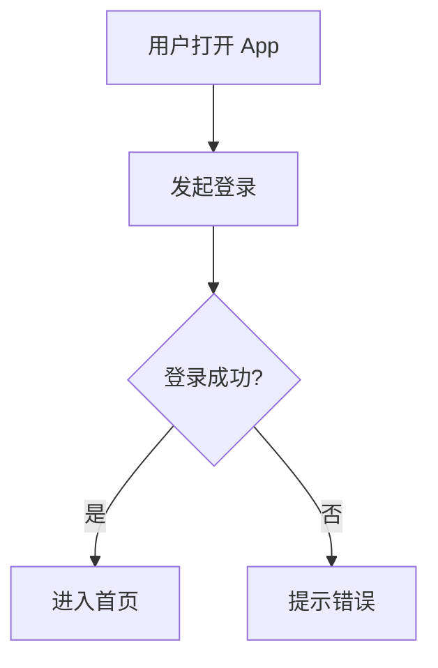
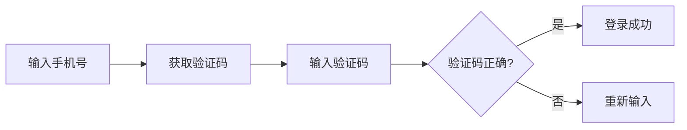
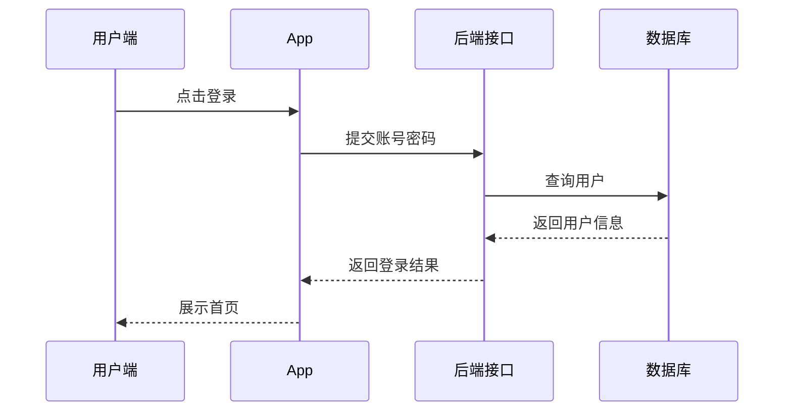
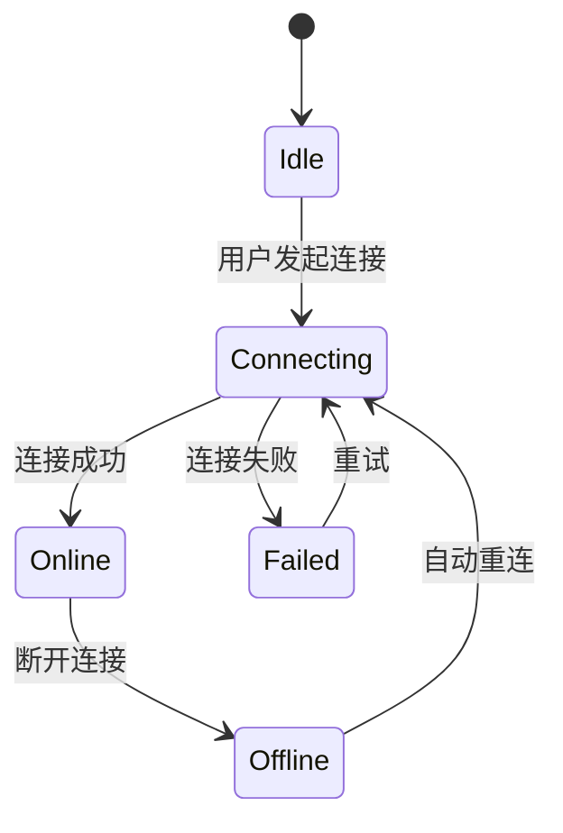
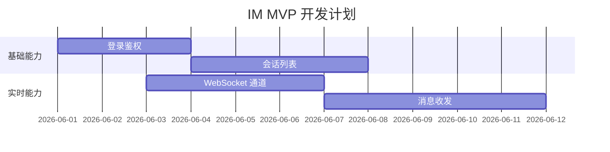
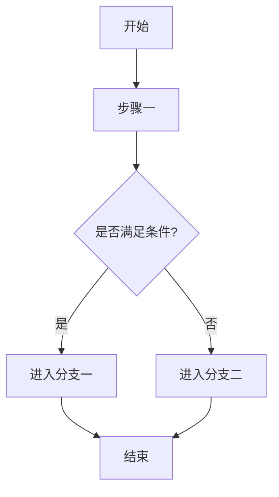
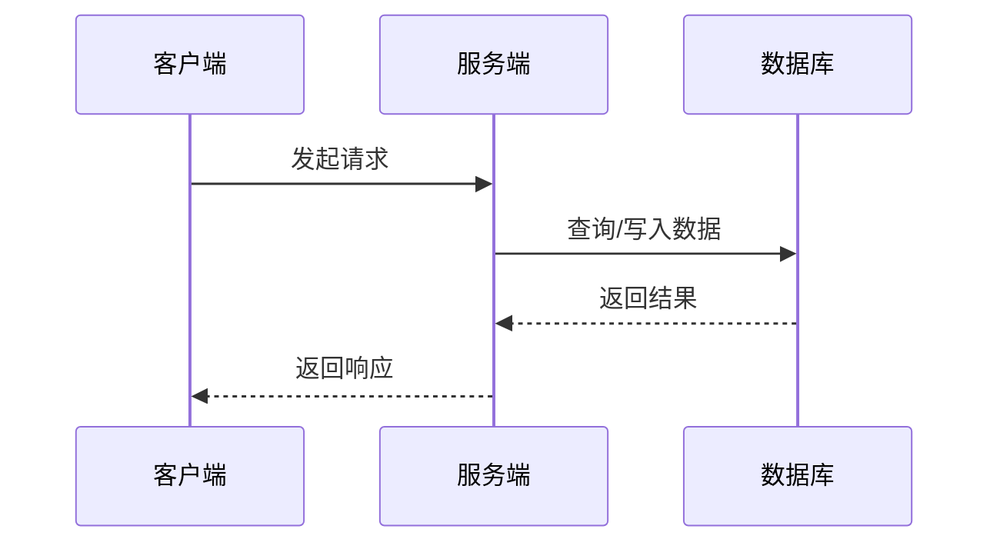
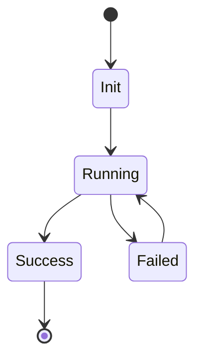
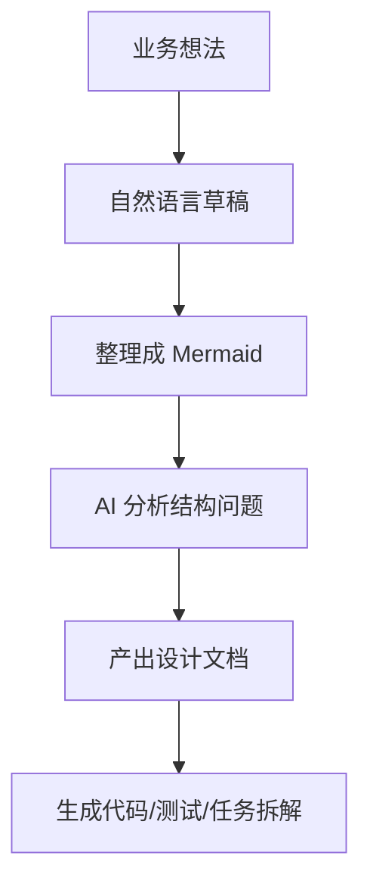

# Mermaid 入门说明

## 1. Mermaid 是什么

Mermaid 是一种“**用文本写图**”的语法工具。

你不用打开画图软件拖方框、拉箭头，而是直接写几行结构化文本，Mermaid 就会把它渲染成流程图、时序图、状态图、甘特图等。

可以先把它理解成：

- Markdown 是“用文本写文档”
- Mermaid 是“用文本写图”

它最大的价值，不是图画得多炫，而是：

- 图和代码一样可以保存、对比、修改
- 图可以放进文档、代码仓库、知识库
- 图可以让人和 AI 都更容易理解结构

## 2. 为什么新手值得学 Mermaid

对新手最友好的点有三个：

1. 语法很少，常用部分很快就能上手
2. 改图非常快，改一行文字就能改结构
3. 很适合写技术文档、产品说明、架构分析、学习笔记

如果你以前觉得“画图很麻烦”，Mermaid 往往会改变这个体验。

## 3. Mermaid 最核心的思路

Mermaid 的核心思路非常简单：

- 先声明图的类型
- 再写节点
- 再写节点之间的关系

比如下面这段：

你暂时不用背语法，只要先看懂逻辑：

- `flowchart TD` 表示这是一个流程图，方向是从上到下
- `A[用户打开 App]` 表示一个节点
- `-->` 表示箭头关系
- `C{登录成功?}` 表示一个判断节点

也就是说，Mermaid 本质上是在写“结构化关系”。

## 4. 新手最常用的几类图

对于大多数人，先掌握这 4 类就够用了：

- 流程图 `flowchart`
- 时序图 `sequenceDiagram`
- 状态图 `stateDiagram-v2`
- 甘特图 `gantt`

下面分别看。

## 5. 流程图：最适合入门

流程图最常用，适合表示：

- 用户操作流程
- 系统处理流程
- 决策分支
- 页面跳转逻辑

示例：

怎么读：

- `LR` 表示从左到右
- 方括号 `[]` 常表示普通步骤
- 花括号 `{}` 常表示条件判断
- 箭头表示流程方向

如果你是新手，建议第一步先学会用流程图描述：

- 一个页面流程
- 一个接口流程
- 一个业务决策流程

## 6. 时序图：特别适合后端和接口说明

时序图用来表达“**谁在什么时候给谁发了什么消息**”。

这对后端、IM、支付、登录、推送、第三方回调等场景非常有用。

示例：

怎么读：

- `participant` 用来定义参与者
- `->>` 表示发送请求或消息
- `-->>` 常用来表示返回结果

如果你做 IM、后端、微服务、接口联调，时序图几乎是必学的。

## 7. 状态图：适合描述状态变化

状态图适合表示一个对象会经历哪些状态，以及如何切换。

比如订单、连接状态、消息状态、任务状态。

示例：

这类图非常适合解释：

- WebSocket 连接状态
- IM 消息发送状态
- 用户在线状态

## 8. 甘特图：适合计划和排期

甘特图适合表示任务时间安排。

示例：

它特别适合：

- 项目计划
- 版本节奏
- 里程碑说明

## 9. Mermaid 语法为什么容易上手

因为它不是传统编程语言，不需要你理解复杂语义。

你只要记住三件事：

1. 图的类型是什么
2. 每个节点写什么
3. 节点之间怎么连接

你可以把它当成“有一点规则的画图 Markdown”。

## 10. 一个新手可直接套用的模板

### 10.1 业务流程模板

### 10.2 接口时序模板

### 10.3 状态流转模板

## 11. Mermaid 最适合用在哪些场景

非常适合：

- 技术方案文档
- 架构说明
- API 流程说明
- IM 消息链路说明
- 登录、支付、推送流程
- 学习笔记和知识沉淀
- PRD、设计稿补充说明

不太适合：

- 特别追求视觉设计感的演示图
- 非常复杂的自由排版海报
- 需要像专业设计软件那样逐像素调整的图

也就是说，Mermaid 更擅长“**表达逻辑**”，不是“装饰页面”。

## 12. 对新手最重要的使用建议

### 12.1 先追求清楚，不要先追求炫

很多新手一开始会想：

- 能不能把图画得很高级
- 能不能排版得像设计图一样

其实最重要的是：

- 节点名称清楚
- 流程方向明确
- 分支条件不含糊
- 图能让别人一眼看懂

### 12.2 先写逻辑，再写 Mermaid

最好的方式通常不是“边想边写 Mermaid”，而是先用自然语言写出：

1. 有哪些角色
2. 有哪些步骤
3. 谁依赖谁
4. 哪些地方有分支

然后再翻译成 Mermaid。

### 12.3 一张图只表达一个核心问题

不要试图把所有内容塞进一张图里。

坏图的典型问题：

- 节点太多
- 连线太多
- 主题太杂
- 看的人不知道重点

更好的做法是：

- 一张图讲一个流程
- 一张图讲一个模块关系
- 一张图讲一个状态机

## 13. Mermaid 在 AI 时代为什么特别重要

这是最值得强调的一点。

Mermaid 在 AI 时代的重要性，不只是“方便画图”，而是它非常适合成为“**人和 AI 共同理解复杂系统的中间表达**”。

### 13.1 Mermaid 把模糊描述变成结构化表达

AI 最擅长处理“结构明确”的内容。

比如你对 AI 说：

- “帮我分析这个登录流程”
- “帮我优化这个 IM 消息投递链路”
- “帮我检查这个状态机是否有遗漏”

如果你只有一大段自然语言，AI 能理解，但容易漏细节。

如果你附上一段 Mermaid 图，AI 会更容易抓住：

- 角色
- 顺序
- 分支
- 状态变化
- 系统边界

也就是说，Mermaid 是把“想法”压缩成“结构”的方式。

### 13.2 AI 很适合生成 Mermaid 初稿

你现在完全可以对 AI 说：

- “把这段登录流程转成 Mermaid 流程图”
- “把这个接口调用关系转成时序图”
- “把这个 IM 重连机制转成状态图”

AI 通常能很快生成一个可以继续修改的草稿。

这意味着：

- 过去要花 20 分钟画的图，现在可能 2 分钟就有初稿
- 你不需要先精通画图工具
- 你更应该把时间放在“逻辑是否正确”上

### 13.3 AI 很适合反向解释 Mermaid

同样，你也可以把 Mermaid 图交给 AI，让它：

- 用大白话解释图的含义
- 检查是否有死循环或遗漏分支
- 生成配套文档
- 转成接口设计、测试用例、任务拆解

这件事在后端架构、IM 协议、系统分析里尤其有价值。

### 13.4 Mermaid 让“文档即资产”更容易成立

在 AI 时代，真正有价值的不是零散聊天记录，而是：

- 结构化文档
- 可追踪图示
- 可复用的设计表达

Mermaid 很适合进入代码仓库，因为它：

- 是纯文本
- 容易版本管理
- 容易做 Diff
- 容易和 Markdown 一起维护
- 容易被 AI 再利用

所以它不是单纯的“画图工具语法”，而是一种适合 AI 时代的知识表达格式。

## 14. Mermaid 对后端和 IM 系统尤其有价值

如果你在做后端、实时系统、IM，Mermaid 的价值会更明显。

你会经常需要表达：

- 登录鉴权流程
- WebSocket 建连流程
- 消息发送与 ACK
- 离线补偿
- 多端同步
- 推送唤醒
- 服务间调用链
- 连接状态机

这些内容只用文字写，容易长、散、绕。

但如果先用 Mermaid 画出来，再让 AI 参与分析，就很容易形成这样的工作流：

这个流程非常适合 AI 编程时代。

## 15. 给完全新手的学习路线

建议按这个顺序学：

1. 先学 `flowchart`
2. 再学 `sequenceDiagram`
3. 再学 `stateDiagram-v2`
4. 最后按需要学 `gantt`

练习方式也很简单：

1. 用 Mermaid 画一个登录流程
2. 画一个“客户端调用后端接口”的时序图
3. 画一个“WebSocket 连接状态机”
4. 让 AI 帮你检查图是否漏分支

只要完成这四步，你基本就已经能把 Mermaid 用起来了。

## 16. 一句话总结

Mermaid 是一种“用文本表达逻辑图”的方式。

对新手来说，它比传统画图更轻；对工程团队来说，它比截图和白板更可维护；对 AI 时代来说，它是连接“自然语言、结构化逻辑、文档、代码”之间的高价值中间层。

如果你只记住一句话，那就是：

**Mermaid 不是为了把图画漂亮，而是为了把复杂逻辑表达清楚，并且让人和 AI 都能高效理解。**
